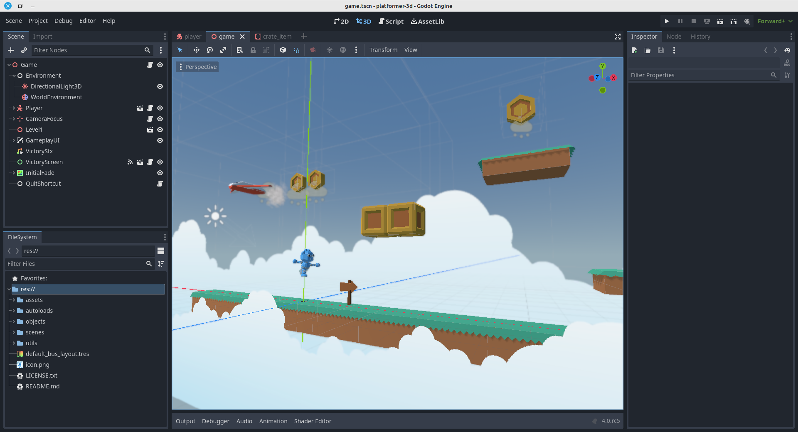

Awesome projects/addons/tutorials for GODOT engine version 4.  
  
=========================================
2D:  

3D:  
- Procedural generation of island : https://github.com/mrlev/FloatingIslandsDemo  version 4.0 alpha3  
- https://github.com/crystal-bit/platform-3d v4.0.2
- 

  

- https://github.com/Jairus04/Godot_4.0_Horror_Character_Controller v4.0.2  
- https://github.com/cesko/godot_fps_test v4.0.2  
- solar-gardener  
- Eco Tribu https://github.com/nikixos/EcoTribu  
- 

  

- https://github.com/BenjaTK/Criss-Cross

- https://github.com/perfoon/Abandoned-Spaceship-Godot-Demo  

  
- https://github.com/mikatomik/Godot-4-Overgrown-Subway-Demo

  
- https://github.com/RPicster/godot4-demo-desert-light

  

* Showcase:  
- Lumberyard Bistro https://github.com/godotengine/godot/issues/74965    

  
- Unreal Sun Temple Reference https://github.com/godotengine/godot/issues/75440. 

SHADERS / FX:  

Charts:  
- https://github.com/fenix-hub/godot-engine.easy-charts  

Addons:  
- https://github.com/ramokz/phantom-camera  
- https://github.com/duongvituan/godot-awesome-splash  
- https://github.com/expressobits/character-controller  
- https://github.com/coppolaemilio/dialogic
- https://github.com/HungryProton/scatter

- https://github.com/dreadpon/godot_spatial_gardener 3D

https://github.com/expressobits/inventory-system-demos 

    

DB:  
- https://github.com/KoBeWi/Godot-Text-Database  

